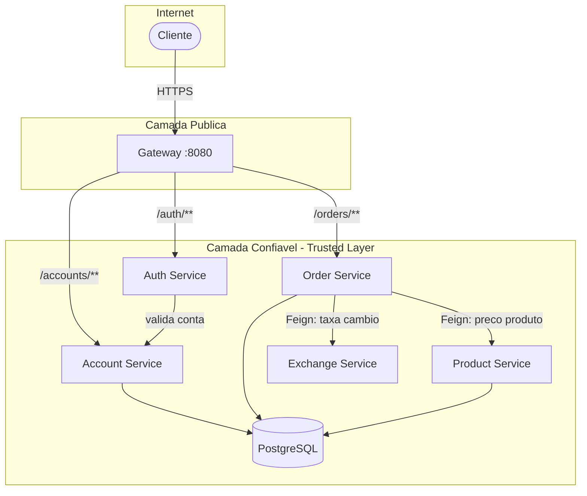
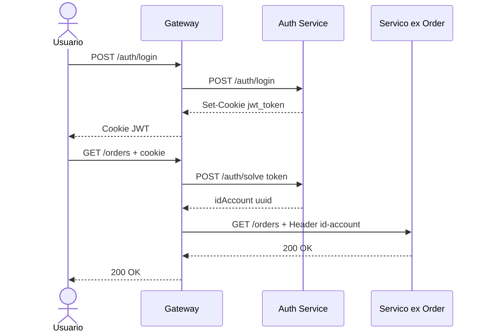
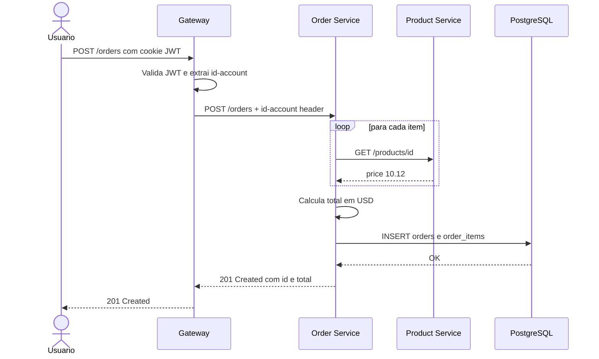
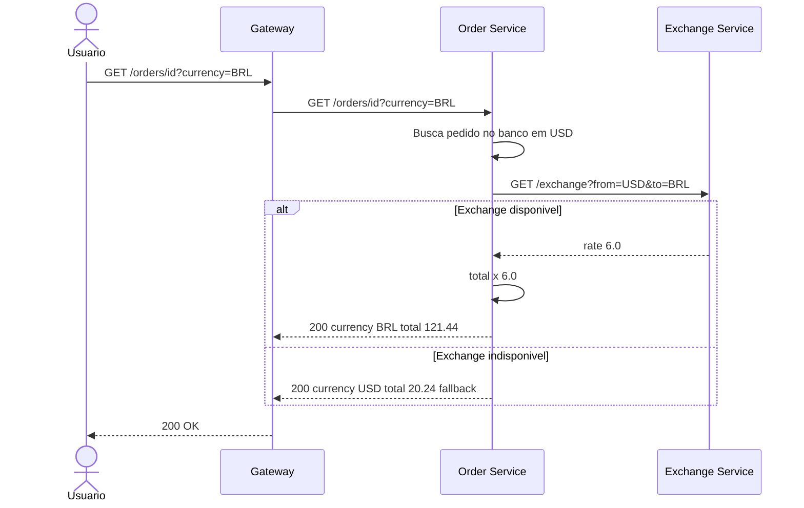
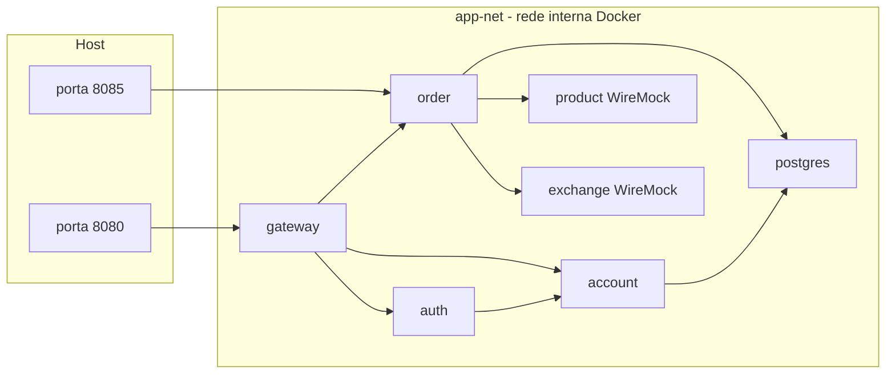

# Arquitetura

## Padrão: API Gateway + Trusted Layer

Todo tráfego externo passa pelo **Gateway**, que valida o JWT antes de rotear para os serviços internos. Os serviços nunca são expostos diretamente à internet — eles confiam nos headers injetados pelo Gateway.

---

## Fluxo de Autenticação

O Gateway intercepta todas as requisições protegidas, extrai o cookie JWT e consulta o Auth Service para obter o `id-account`. Esse header é então injetado na requisição antes de encaminhá-la ao serviço destino.

---

## Fluxo de Criação de Pedido

---

## Fluxo de Consulta com Conversão de Moeda

---

## Topologia de Rede (Docker Compose)

Os serviços se comunicam pelo hostname interno (`order`, `account`, etc.). Apenas o Gateway e o Order service têm portas expostas no host.

---

## Schemas do Banco de Dados

Cada serviço possui seu próprio schema, garantindo isolamento de dados:

| Schema | Serviço | Tabelas |
|--------|---------|---------|
| `accounts` | Account Service | `accounts` |
| `orders` | Order Service | `orders`, `order_items` |
| `products` | Product Service | `products` *(em breve)* |
