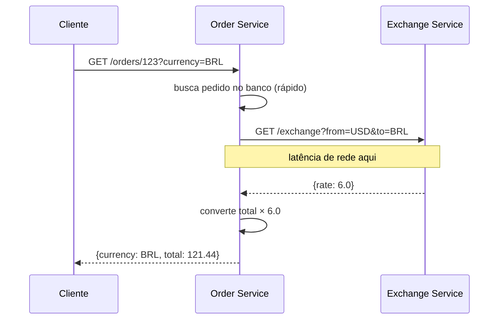
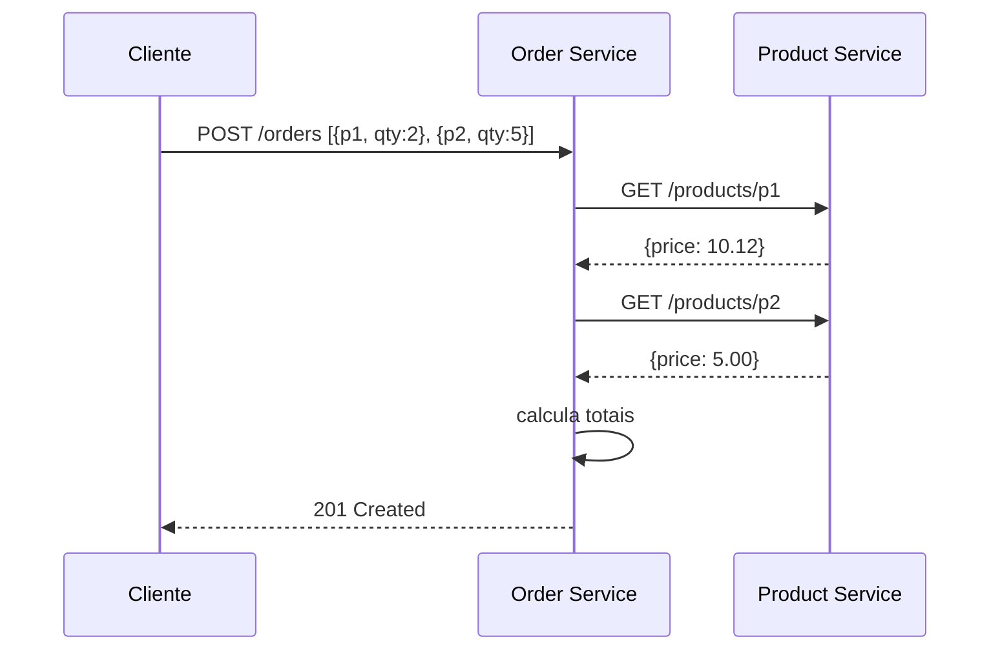

# Bottlenecks

Dois gargalos identificados durante o desenvolvimento da Order API, com análise do problema e solução adotada.

---

## 1. Latência do Exchange Service

### Problema

Toda chamada a `GET /orders/{id}?currency=<moeda>` dispara uma requisição HTTP síncrona ao Exchange Service. Em produção, isso adiciona latência de rede em cada consulta com conversão — mesmo que a taxa de câmbio não mude por horas.



Com N consultas simultâneas buscando a mesma moeda, são N chamadas ao Exchange Service — a latência escala linearmente com a carga.

### Solução Adotada

Implementado **fallback gracioso**: se o Exchange Service estiver indisponível (qualquer `FeignException` não mapeada), o serviço retorna os valores em USD sem lançar erro para o cliente.

```java
} catch (FeignException e) {
    // Exchange service unavailable — serve USD as fallback
    return BigDecimal.ONE;
}
```

Isso evita que uma falha na dependência externa derrube o fluxo principal. O cliente recebe uma resposta válida (em USD) em vez de um erro 503.

### Melhoria Futura

Cache em memória com TTL de 60 segundos no `ExchangeClient`. Taxas de câmbio raramente mudam em janelas de 1 minuto — uma única requisição ao Exchange Service por minuto substitui potencialmente centenas.

---

## 2. Acoplamento Síncrono com o Product Service

### Problema

A criação de pedido (`POST /orders`) requer uma chamada síncrona ao Product Service para cada item, a fim de obter o preço. Com pedidos de múltiplos itens, as chamadas são sequenciais — o tempo total cresce com o número de itens.



Se o Product Service estiver lento ou fora do ar, o `POST /orders` falha ou demora — mesmo que o produto seja válido e o preço já fosse conhecido.

### Solução Adotada

O `ProductFeignConfig` classifica erros do Product Service com semântica precisa:

```java
return (methodKey, response) -> {
    if (response.status() == 404) {
        return new ProductNotFoundException();    // → 400 Bad Request
    }
    return new ProductApiUnavailableException();  // → 502 Bad Gateway
};
```

| Situação | Status retornado | Motivo |
|----------|-----------------|--------|
| Produto não existe | `400 Bad Request` | Erro do cliente — produto inválido |
| Product Service fora do ar | `502 Bad Gateway` | Erro de dependência externa |

Isso dá ao cliente informação precisa sobre a causa do erro, evitando confusão entre "produto inválido" e "serviço temporariamente indisponível".

Adicionalmente, **o preço é armazenado no `order_item` no momento da criação** (`total` persistido no banco). Consultas futuras ao pedido não precisam consultar o Product Service — o valor já está fixado no banco de dados.

### Melhoria Futura

Para a criação em si, um **circuit breaker** (ex: Resilience4j) poderia evitar cascata de falhas: após N falhas consecutivas, as chamadas ao Product Service são bloqueadas por um período, permitindo que o serviço se recupere sem sobrecarregar com requisições acumuladas.
