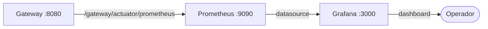
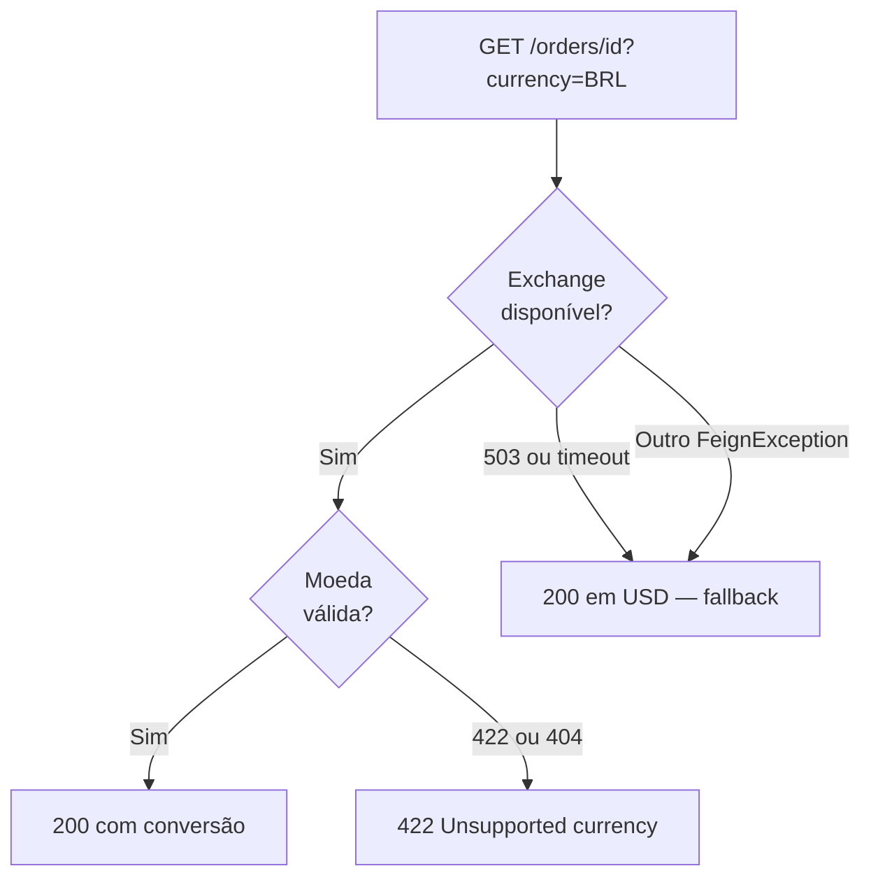

# Bottlenecks

Gargalos identificados no projeto, com análise do problema, solução implementada e evidência no código real.

---

## 1. Observabilidade: Latência invisível do Gateway

### O problema

Sem métricas, é impossível saber se o Gateway está lento, qual rota tem mais tráfego ou quando ocorrem picos de latência. O sistema vira uma caixa-preta em produção.

### A solução implementada

O Gateway expõe métricas no formato Prometheus via Spring Boot Actuator. O Prometheus coleta em intervalo de **1 segundo** e o Grafana visualiza em tempo real.

**Configuração no `application.yaml` do gateway:**
```yaml
spring:
  cloud:
    gateway:
      metrics:
        enabled: true        # habilita métricas por rota

management:
  endpoints:
    web:
      base-path: /gateway/actuator
      exposure:
        include: ['prometheus']   # expõe endpoint /gateway/actuator/prometheus
```

**Configuração no `api/setup/prometheus/prometheus.yml`:**
```yaml
scrape_configs:
  - job_name: 'GatewayMetrics'
    metrics_path: '/gateway/actuator/prometheus'
    scrape_interval: 1s        # coleta a cada 1 segundo
    static_configs:
      - targets:
          - gateway:8080
        labels:
          application: 'Gateway Application'
```

**Serviços no `compose.yaml`:**
```yaml
prometheus:
  image: prom/prometheus:latest
  ports:
    - 9090:9090
  volumes:
    - ${SETUP}/prometheus/prometheus.yml:/etc/prometheus/prometheus.yml

grafana:
  image: grafana/grafana:latest
  ports:
    - 3000:3000
```

### Fluxo de observabilidade



### Resultado

- Métricas disponíveis: `spring.cloud.gateway.requests` (por rota, status, método)
- Latência de cada rota visível em tempo real
- Base para alertas de SLA (`[IMPLEMENTAR]` — configurar alertas no Grafana)

---

## 2. Resiliência: Fallback gracioso quando Exchange Service cai

### O problema

A conversão de moeda em `GET /orders/{id}?currency=BRL` depende de uma chamada síncrona ao Exchange Service. Se o serviço externo cair, sem tratamento o Order Service retornaria 500 para o cliente — derrubando uma funcionalidade central por culpa de uma dependência opcional.

### A solução implementada

O `OrderService` implementa dois níveis de fallback:

**Nível 1 — Exchange indisponível (qualquer FeignException não mapeada):**
```java
// OrderService.java
} catch (FeignException e) {
    // Fallback to storage currency (USD) when exchange service is unavailable.
    return BigDecimal.ONE;  // rate = 1 → sem conversão, retorna em USD
}
```

**Nível 2 — Moeda inválida (422) ou não encontrada (404):**
```java
} catch (FeignException.UnprocessableEntity e) {
    throw new ResponseStatusException(HttpStatus.UNPROCESSABLE_ENTITY, "Unsupported currency");
} catch (FeignException.NotFound e) {
    throw new ResponseStatusException(HttpStatus.UNPROCESSABLE_ENTITY, "Unsupported currency");
}
```

**Nível 3 — Product Service fora do ar (classificação precisa de erros):**
```java
// ProductFeignConfig.java
return (methodKey, response) -> {
    if (response.status() == 404) {
        return new ProductNotFoundException();    // → 400 Bad Request
    }
    return new ProductApiUnavailableException();  // → 502 Bad Gateway
};
```

### Diagrama de decisão



### Resultado

| Cenário | Antes | Depois |
|---------|-------|--------|
| Exchange fora do ar | 500 (crash) | 200 em USD (fallback) |
| Moeda inválida | 500 (crash) | 422 com mensagem clara |
| Product não encontrado | 500 (genérico) | 400 "Product does not exist" |
| Product Service fora do ar | 500 (genérico) | 502 Bad Gateway |

Cobertura de testes confirmada:
```
shouldKeepUsdValuesWhenExchangeServiceIsUnavailable  ✅
shouldReturn422WhenCurrencyIsInvalid                 ✅
shouldReturn400WhenProductDoesNotExist               ✅
shouldReturn502WhenProductServiceIsUnavailable       ✅
```

---

## 3. Performance: Índices no banco de dados

### O problema

As duas queries mais frequentes da Order API são:

1. `findByIdAccountOrderByDateDesc(idAccount)` — lista todos os pedidos de uma conta, ordenado por data
2. `findByIdOrder(idOrder)` — busca os itens de um pedido

Sem índices, ambas fazem **full table scan** — custo O(n) que degrada linearmente com o volume de dados.

### A solução implementada

Migration `V2026.04.30.004__create_indexes.sql`:

```sql
-- Cobre o WHERE id_account = ? ORDER BY date DESC
CREATE INDEX idx_orders_account_date ON orders.orders (id_account, date);

-- Cobre o WHERE id_order = ?
CREATE INDEX idx_order_items_order ON orders.order_items (id_order);
```

O índice composto `(id_account, date)` é especialmente eficiente: satisfaz tanto o filtro por conta quanto a ordenação, evitando um sort separado.

### Resultado

| Query | Sem índice | Com índice |
|-------|-----------|-----------|
| `findByIdAccountOrderByDateDesc` | Full scan + sort | Index range scan + no sort |
| `findByIdOrder` | Full scan | Index lookup |

---

## Melhorias Futuras

| Melhoria | Status | Justificativa |
|----------|--------|---------------|
| Cache no `ExchangeClient` (Redis, TTL 60s) | `[IMPLEMENTAR]` | Taxas de câmbio mudam raramente — 1 req/min substitui N req/min |
| HPA no EKS (escala horizontal por CPU) | `[IMPLEMENTAR]` | Cluster `ng-store` com 1 node atualmente |
| Circuit Breaker (Resilience4j) no `ProductClient` | `[IMPLEMENTAR]` | Evita cascata de falhas em picos de erro |
| Alertas no Grafana (latência > threshold) | `[IMPLEMENTAR]` | Infraestrutura Prometheus/Grafana já está pronta |
