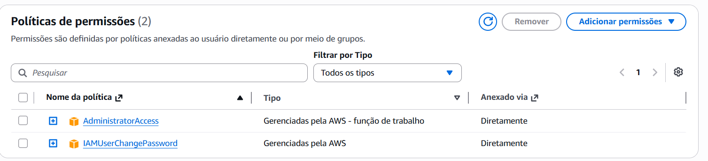
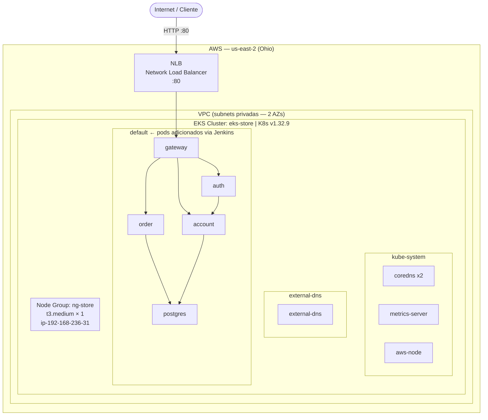

# AWS

## Conta e Acesso

A conta AWS foi criada especificamente para o projeto. O acesso programático é feito via **IAM user** com permissões suficientes para gerenciar EKS, EC2 e NLB.

!!! danger "Segredos nunca no código"
    As credenciais AWS **nunca** aparecem em arquivos commitados. São configuradas localmente via `aws configure` e no Jenkins via credenciais gerenciadas pela plataforma.

### Configuração local (AWS CLI)

```bash
aws configure
```

Preencha com seus valores reais — **nunca coloque no repositório**:

```
AWS Access Key ID:     YOUR_ACCESS_KEY_ID
AWS Secret Access Key: YOUR_SECRET_ACCESS_KEY
Default region name:   us-east-2
Default output format: json
```

O CLI armazena essas informações em `~/.aws/credentials` (fora do repositório).

### Proteção de credenciais

| Mecanismo | Onde |
|-----------|------|
| `~/.aws/credentials` local | Fora do repositório (gitignore global) |
| Jenkins Credentials | Configuradas na UI do Jenkins — nunca em Jenkinsfile |
| `.env` | No `.gitignore` do projeto — contém apenas variáveis de runtime |
| `secrets.example.yaml` | Somente placeholders (`change-me`) commitados |


*Console AWS → IAM → Users — políticas e permissões do usuário do projeto*

---

## Região e Serviços Utilizados

| Serviço AWS | Função no Projeto |
|-------------|-------------------|
| **EKS** | Orquestração dos microsserviços em Kubernetes |
| **EC2** (node group) | Nodes workers do cluster EKS |
| **NLB** (Network Load Balancer) | Exposição do Gateway para a internet |
| **ECR** *(opcional)* | Alternativa ao Docker Hub para imagens |

> Região utilizada: `us-east-2` (Ohio). Cluster `eks-store` ativo com node group `ng-store`.

---

## Diagrama de Arquitetura AWS



> **Estado atual:** pods do `kube-system` e `external-dns` rodando. Pods de aplicação (`gateway`, `auth`, `account`, `order`, `postgres`) serão adicionados após o deploy via Jenkins.

---

## Teardown

!!! warning "Cuidado com custos"
    Recursos AWS geram custos enquanto estiverem provisionados. Após a apresentação, execute o teardown para evitar cobranças.

```bash
# Deletar node group (para EC2)
eksctl delete nodegroup --cluster=eks-store --name=ng-store

# Deletar cluster EKS
eksctl delete cluster --name=eks-store

# Verificar que não há recursos órfãos
aws ec2 describe-instances --query 'Reservations[*].Instances[*].[InstanceId,State.Name]' --output table
aws elb describe-load-balancers
```
