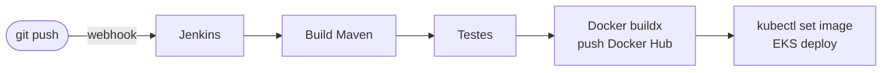
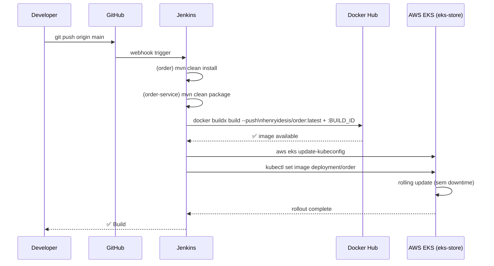

# CI/CD — Jenkins

## Visão Geral

O Jenkins é executado como container Docker, com acesso ao socket do host (`/var/run/docker.sock`) para poder construir e publicar imagens. Também tem `kubectl` e `aws` instalados para deploy no EKS.



---

## Infraestrutura do Jenkins

O Jenkins é configurado em `jenkins/compose.yaml`. As ferramentas instaladas no container:

| Ferramenta | Versão | Uso |
|-----------|--------|-----|
| JDK 25 | LTS | Build Maven |
| Maven | sistema | `mvn package` |
| Docker CE | latest | `docker buildx build` |
| kubectl | stable | Deploy no EKS |
| AWS CLI v2 | latest | `aws eks update-kubeconfig` |

Para subir o Jenkins:

```bash
cd jenkins
docker compose up -d --build
```

Acesse em `http://localhost:9080`.

---

## Credenciais Configuradas no Jenkins

As credenciais são configuradas via **Jenkins > Manage Jenkins > Credentials** — **nunca hardcoded nos Jenkinsfiles**.

| ID no Jenkins | Tipo | Uso |
|--------------|------|-----|
| `dockerhub-credential` | Username/Password | Login no Docker Hub para push das imagens |
| `github-credential` *(se configurado)* | Username/Token | Clone dos repositórios privados |
| AWS credentials | AWS Credentials | `aws eks update-kubeconfig` + deploy |

!!! info "Mecanismo withCredentials"
    O Jenkins injeta as credenciais como variáveis de ambiente durante o estágio, sem expô-las em logs ou arquivos:
    ```groovy
    withCredentials([usernamePassword(
        credentialsId: 'dockerhub-credential',
        usernameVariable: 'USERNAME',
        passwordVariable: 'TOKEN')]) {
        sh "docker login -u $USERNAME -p $TOKEN"
    }
    ```
    As variáveis `USERNAME` e `TOKEN` existem apenas no escopo do bloco e são mascaradas nos logs.

---

## Pipelines por Serviço

### order (contrato da API)

Arquivo: `api/order/Jenkinsfile`

```groovy
pipeline {
    agent any
    stages {
        stage('Build') {
            steps {
                sh 'mvn -B -DskipTests clean install'
            }
        }
    }
}
```

Apenas instala o módulo no repositório Maven local — sem imagem Docker, pois é uma dependência de biblioteca.

---

### order-service

Arquivo: `api/order-service/Jenkinsfile`

```groovy
pipeline {
    agent any
    environment {
        SERVICE = 'order'
        NAME = "henryidesis/${env.SERVICE}"
    }
    stages {
        stage('Dependencies') {
            steps {
                build job: 'order', wait: true   // garante que o contrato está instalado
            }
        }
        stage('Build') {
            steps {
                sh 'mvn -B -DskipTests clean package'
            }
        }
        stage('Build & Push Image') {
            steps {
                withCredentials([usernamePassword(
                    credentialsId: 'dockerhub-credential',
                    usernameVariable: 'USERNAME',
                    passwordVariable: 'TOKEN')]) {
                    sh "docker login -u $USERNAME -p $TOKEN"
                    sh "docker buildx create --use --platform=linux/arm64,linux/amd64 --node multi-platform-builder-${env.SERVICE} --name multi-platform-builder-${env.SERVICE}"
                    sh "docker buildx build --platform=linux/arm64,linux/amd64 --push --tag ${env.NAME}:latest --tag ${env.NAME}:${env.BUILD_ID} -f Dockerfile ."
                    sh "docker buildx rm --force multi-platform-builder-${env.SERVICE}"
                }
            }
        }
    }
}
```

**Destaques:**
- Depende do job `order` (contrato) antes de buildar
- Publica para `henryidesis/order:latest` **e** `henryidesis/order:{BUILD_ID}` — rastreabilidade por número de build
- Multi-arch: `linux/amd64` + `linux/arm64` — compatível com EC2 x86 e Apple Silicon

---

### gateway-service

Arquivo: `api/gateway-service/Jenkinsfile`

Mesma estrutura do `order-service`, sem estágio de dependências (gateway não depende de outro módulo Maven do projeto).

Publica: `henryidesis/gateway:latest`

---

## Deploy no EKS

Após o push da imagem, o Jenkins executa `kubectl` para atualizar os deployments no cluster `eks-store`:

```bash
# Configurar contexto do cluster (feito uma vez via credenciais AWS no Jenkins)
aws eks update-kubeconfig --name eks-store --region us-east-2

# Aplicar os manifests do postgres (se ainda não estiver rodando)
kubectl apply -f api/postgres-service/k8s/configmap.yaml
kubectl apply -f api/postgres-service/k8s/secrets.yaml   # não commitado
kubectl apply -f api/postgres-service/k8s/deployment.yaml
kubectl apply -f api/postgres-service/k8s/service.yaml

# Fazer rolling update da imagem recém-publicada
kubectl set image deployment/order order=henryidesis/order:latest
kubectl rollout status deployment/order

kubectl set image deployment/gateway gateway=henryidesis/gateway:latest
kubectl rollout status deployment/gateway
```

!!! info "secrets.yaml nunca no git"
    O arquivo `api/postgres-service/k8s/secrets.example.yaml` tem apenas `change-me` como placeholder e pode ser commitado. O arquivo `secrets.yaml` com valores reais **nunca** vai para o repositório.

---

## Fluxo Completo de Deploy


