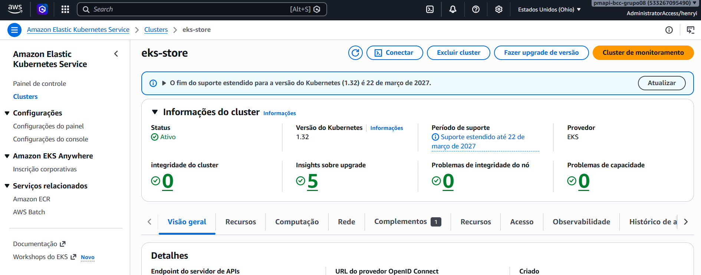
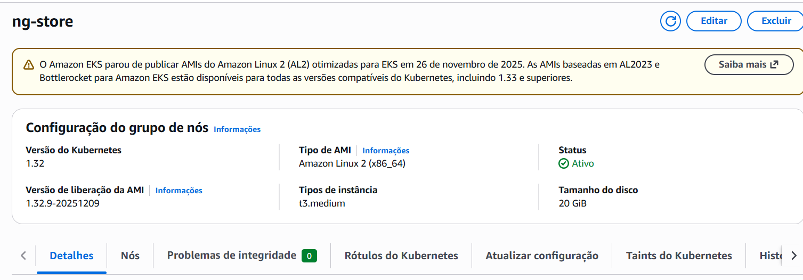
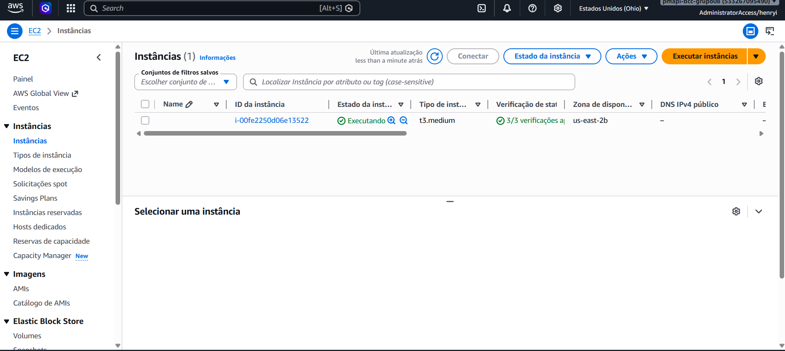

# EKS — Kubernetes na AWS

## Visão Geral do Cluster

O cluster EKS gerencia os pods de todos os microsserviços. O plano de controle (control plane) é gerenciado pela AWS — só os nodes EC2 são responsabilidade do projeto.

| Parâmetro | Valor |
|-----------|-------|
| Nome do cluster | `eks-store` |
| Região | `us-east-2` |
| Versão Kubernetes | `v1.32.9` |
| Node group | `ng-store` |
| Status do node group | `ACTIVE` |
| Tipo de instância EC2 | `t3.medium` |
| Nodes desired / ativos | `1` |
| Node | `ip-192-168-236-31.us-east-2.compute.internal` |
| Status do node | `Ready` |


*Console AWS → EKS → eks-store — visão geral do cluster*

### Node Group ng-store


*Console AWS → EKS → eks-store → Node Groups → ng-store*

---

## Criação do Cluster

O cluster foi criado com `eksctl`, que provisiona automaticamente VPC, subnets, roles IAM e node group:

```bash
eksctl create cluster \
  --name eks-store \
  --region us-east-2 \
  --nodegroup-name ng-store \
  --node-type t3.medium \
  --nodes 1
```

**Justificativa da instância EC2:** `t3.medium` oferece equilíbrio entre custo e capacidade de memória para rodar múltiplos pods simultaneamente (gateway, auth, account, order, postgres). Instâncias maiores aumentariam custo sem benefício real no volume de carga do projeto.

---

## Configuração do kubectl

Após criação do cluster, configure o contexto local:

```bash
aws eks update-kubeconfig \
  --name eks-store \
  --region us-east-2
```

Verificar conectividade:

```bash
kubectl get nodes
kubectl get pods --all-namespaces
```

### Estado atual do cluster

```
NAME                                                    STATUS   ROLES    AGE
ip-192-168-236-31.us-east-2.compute.internal            Ready    <none>   ...
```

```
NAMESPACE      NAME                                  READY   STATUS
external-dns   external-dns-6b84d94b8f-tszv6         1/1     Running
kube-system    aws-node-mfbml                        2/2     Running
kube-system    coredns-5b9bd5bc84-8wl5c              1/1     Running
kube-system    coredns-5b9bd5bc84-qkqjc              1/1     Running
kube-system    metrics-server-646b8d7599-4pvmr       1/1     Running
```

!!! info "Pods de aplicação"
    Os pods de `gateway`, `auth`, `account`, `order` e `postgres` ainda não estão no cluster — serão adicionados após o deploy via pipeline Jenkins. Veja [CI/CD](cicd.md).


*Console AWS → EKS → eks-store → Nodes (instâncias EC2 worker)*

---

## Manifests Kubernetes

O projeto contém manifests K8s para o banco de dados PostgreSQL em `api/postgres-service/k8s/`:

```
postgres-service/k8s/
├── configmap.yaml       ← POSTGRES_DB, POSTGRES_HOST
├── secrets.example.yaml ← template com placeholders (change-me)
├── deployment.yaml      ← Pod postgres (1 réplica, limits: 512Mi / 500m CPU)
└── service.yaml         ← ClusterIP :5432
```

### Aplicar no cluster

```bash
# 1. Criar secrets REAIS a partir do exemplo (não commitar o secrets.yaml real)
cp api/postgres-service/k8s/secrets.example.yaml api/postgres-service/k8s/secrets.yaml
# Edite secrets.yaml com os valores reais — NUNCA commite este arquivo

# 2. Aplicar na ordem correta
kubectl apply -f api/postgres-service/k8s/configmap.yaml
kubectl apply -f api/postgres-service/k8s/secrets.yaml
kubectl apply -f api/postgres-service/k8s/deployment.yaml
kubectl apply -f api/postgres-service/k8s/service.yaml
```

!!! danger "secrets.yaml nunca no git"
    O arquivo `secrets.example.yaml` (com `change-me`) pode ser commitado. O `secrets.yaml` real, com valores reais, **nunca**.

### Resources do Pod Postgres

Conforme `deployment.yaml`:

```yaml
resources:
  requests:
    memory: "256Mi"
    cpu: "250m"
  limits:
    memory: "512Mi"
    cpu: "500m"
```

---

## Deploy dos Microsserviços

!!! note "Status atual"
    Os pods de aplicação ainda não estão no cluster. O cluster está provisionado e pronto para receber o deploy via Jenkins.

Após o build das imagens via Jenkins, o deploy no cluster é feito com:

```bash
# Exemplo para o order-service
kubectl set image deployment/order order=henryidesis/order:latest
kubectl rollout status deployment/order
```

O CI/CD Jenkins já tem `kubectl` instalado (via `jenkins/compose.yaml`) e acesso ao cluster configurado via credenciais AWS.

Após os deploys, o estado esperado é:

```
NAMESPACE   NAME          READY   STATUS
default     gateway       1/1     Running
default     auth          1/1     Running
default     account       1/1     Running
default     order         1/1     Running
default     postgres      1/1     Running
```

---

## Exposição via NLB

O Gateway é exposto externamente através de um **Network Load Balancer** criado automaticamente pelo Kubernetes ao declarar um Service do tipo `LoadBalancer`:

```yaml
apiVersion: v1
kind: Service
metadata:
  name: gateway
spec:
  type: LoadBalancer   # AWS provisiona um NLB automaticamente
  ports:
    - port: 80
      targetPort: 8080
  selector:
    app: gateway
```

O endpoint externo do NLB pode ser consultado com:

```bash
kubectl get svc gateway
# Copie o valor de EXTERNAL-IP
```

---

## Teardown

!!! warning "Execute após a apresentação"
    O node group `ng-store` gera custo enquanto estiver ativo (~$0,0416/hora por `t3.medium`). Desligue após a apresentação.

### 1. Deletar o node group (para a cobrança das EC2s)

```bash
aws eks delete-nodegroup \
  --cluster-name eks-store \
  --nodegroup-name ng-store \
  --region us-east-2
```

Acompanhe o status até `DELETED`:

```bash
aws eks describe-nodegroup \
  --cluster-name eks-store \
  --nodegroup-name ng-store \
  --region us-east-2 \
  --query 'nodegroup.status'
```

### 2. Deletar o cluster EKS (para o control plane)

```bash
eksctl delete cluster \
  --name eks-store \
  --region us-east-2
```

### 3. Verificar recursos órfãos

```bash
# Instâncias EC2 ainda rodando?
aws ec2 describe-instances \
  --region us-east-2 \
  --query 'Reservations[*].Instances[*].[InstanceId,State.Name,InstanceType]' \
  --output table

# Load Balancers ainda ativos?
aws elbv2 describe-load-balancers \
  --region us-east-2 \
  --output table
```

!!! tip "Se sobrar Load Balancer"
    Às vezes um NLB persiste após deletar o cluster. Remova manualmente: Console AWS → EC2 → Load Balancers → selecione e exclua.

`[ADICIONAR_SCREENSHOT]` — screenshot do Console AWS → EKS após teardown confirmando status `DELETED`
