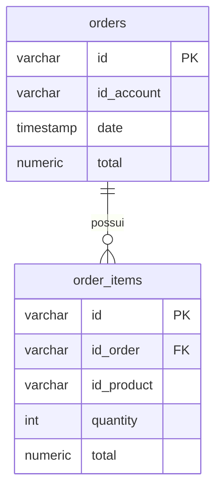

# Order API

## Visão Geral

A Order API gerencia pedidos de usuários autenticados. Cada pedido contém um ou mais itens com referência a produtos e quantidades. O valor total é calculado no momento da criação a partir do preço dos produtos e armazenado em USD. Na consulta, o total pode ser convertido para outra moeda sob demanda.

## Repositórios

| Módulo | Função | Link |
|--------|--------|------|
| `order` | Contrato da API: interface `OrderController` (FeignClient) + DTOs | [pma.261.order](https://github.com/microservice-henry/pma.261.order) |
| `order-service` | Implementação: lógica de negócio, persistência, testes | [pma.261.order-service](https://github.com/microservice-henry/pma.261.order-service) |

## Modelo de Dados

## Migrations (Flyway)

As tabelas são criadas automaticamente via Flyway no schema `orders`:

| Migration | Conteúdo |
|-----------|----------|
| `V2026.04.30.001` | Criação do schema `orders` |
| `V2026.04.30.002` | Tabela `orders` |
| `V2026.04.30.003` | Tabela `order_items` |
| `V2026.04.30.004` | Índices de performance |

## Dependências Externas

| Serviço | Uso | Comportamento quando indisponível |
|---------|-----|----------------------------------|
| Product Service | Preço do produto no `POST /orders` | Retorna `502 Bad Gateway` |
| Exchange Service | Taxa de câmbio no `GET /orders/{id}?currency=` | Fallback: retorna valores em USD |

!!! info "Mocks para desenvolvimento"
    Durante o desenvolvimento local, Product e Exchange são simulados por **WireMock**. Não é necessário subir esses serviços reais.
