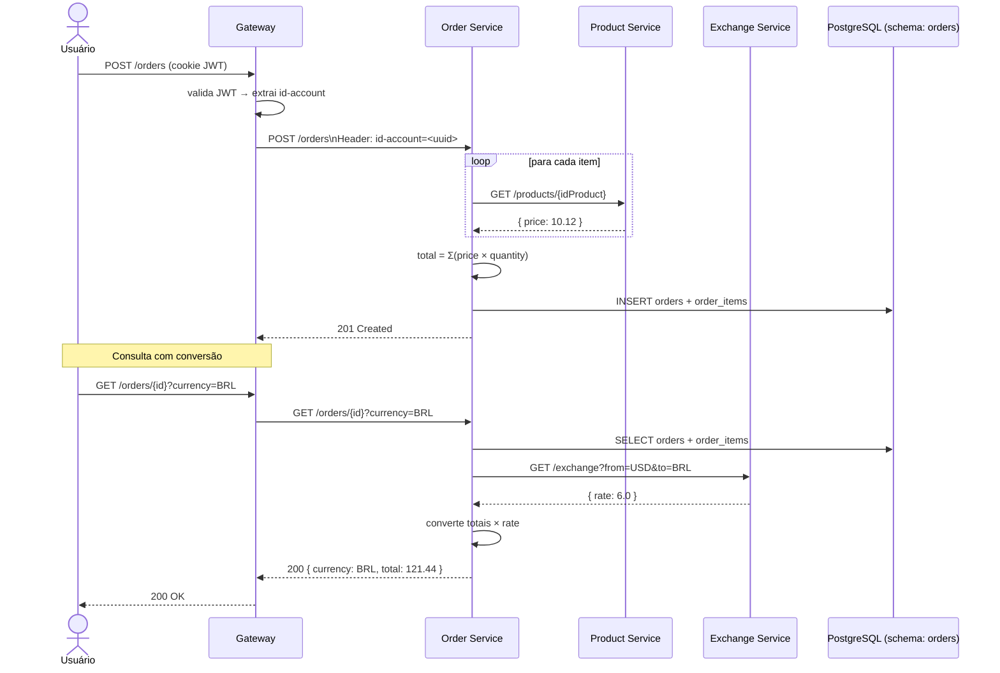
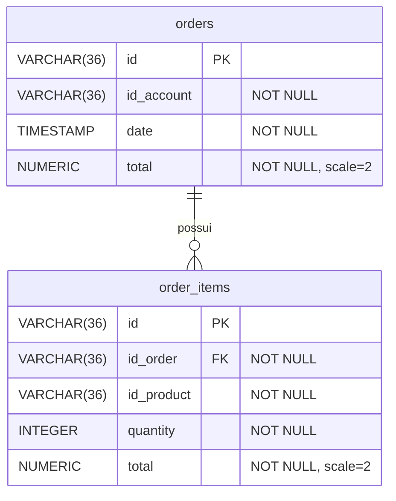

# Order API — Visão Geral

## Responsabilidade

O Order Service gerencia pedidos de usuários autenticados. Cada pedido contém um ou mais itens referenciando produtos externos. O total é calculado em USD no momento da criação e pode ser convertido para outras moedas sob demanda.

Este serviço é de responsabilidade de **Henry Idesis**. As dependências externas (Product API, Exchange API) são implementadas por outros membros do grupo e consumidas via **OpenFeign**.

---

## Repositórios

| Módulo | Função |
|--------|--------|
| [pma.261.order](https://github.com/microservice-henry/pma.261.order) | Contrato: `OrderController` (FeignClient) + todos os DTOs |
| [pma.261.order-service](https://github.com/microservice-henry/pma.261.order-service) | Implementação: `OrderResource`, `OrderService`, JPA, testes |

---

## Fluxo de Dados



---

## Autenticação

O serviço nunca valida o JWT diretamente. O **Gateway** intercepta todas as requisições, extrai o `id-account` do token e o injeta como header antes de encaminhar ao Order Service:

```java
// OrderController.java — o header chega injetado pelo Gateway
@PostMapping("/orders")
public ResponseEntity<OrderOut> create(
    @RequestHeader("id-account") String idAccount,
    @RequestBody OrderIn in
);
```

Se `id-account` estiver ausente ou vazio, o serviço retorna `401 Unauthorized`:

```java
private void validateAccount(String idAccount) {
    if (idAccount == null || idAccount.trim().isEmpty()) {
        throw new ResponseStatusException(HttpStatus.UNAUTHORIZED, "Authenticated account is required");
    }
}
```

---

## Endpoints

### POST /orders

Cria um pedido. Para cada item, consulta o Product Service para obter o preço e calcula o total em USD.

**Request body:**
```json
{
  "items": [
    { "idProduct": "0195abfb-7074-73a9-9d26-b4b9fbaab0a8", "quantity": 2 }
  ]
}
```

**Responses:**

| Status | Condição |
|--------|----------|
| `201 Created` | Pedido criado |
| `400 Bad Request` | Produto não existe ou items vazio |
| `401 Unauthorized` | Sem `id-account` válido |
| `502 Bad Gateway` | Product Service indisponível |

**Response 201:**
```json
{
  "id": "d4e5f6a7-0001-0000-0000-000000000000",
  "date": "2025-09-01T12:30:00",
  "items": [
    {
      "id": "item-uuid",
      "product": { "id": "0195abfb-7074-73a9-9d26-b4b9fbaab0a8" },
      "quantity": 2,
      "total": 20.24
    }
  ],
  "total": 20.24
}
```

!!! note "Currency"
    O campo `currency` não aparece na resposta do `POST` — valores são sempre armazenados em USD.

---

### GET /orders

Lista pedidos da conta autenticada em ordem decrescente de data. Retorna apenas o resumo (sem itens detalhados).

**Responses:**

| Status | Condição |
|--------|----------|
| `200 OK` | Lista retornada (pode ser `[]`) |
| `401 Unauthorized` | Sem `id-account` válido |

**Response 200:**
```json
[
  {
    "id": "d4e5f6a7-0001-0000-0000-000000000000",
    "date": "2025-09-01T12:30:00",
    "total": 20.24
  }
]
```

Implementado via:
```java
return orderRepository.findByIdAccountOrderByDateDesc(idAccount)
    .stream().map(OrderModel::to).toList();
```

---

### GET /orders/{id}

Retorna detalhes completos de um pedido. Aceita `?currency=` para converter os totais via Exchange Service.

**Responses:**

| Status | Condição |
|--------|----------|
| `200 OK` | Pedido encontrado |
| `401 Unauthorized` | Sem `id-account` válido |
| `404 Not Found` | Pedido não existe ou pertence a outra conta |
| `422 Unprocessable Entity` | Moeda não suportada |

**Response 200 com `?currency=BRL`:**
```json
{
  "id": "d4e5f6a7-0001-0000-0000-000000000000",
  "date": "2025-09-01T12:30:00",
  "currency": "BRL",
  "items": [
    {
      "id": "item-uuid",
      "product": { "id": "0195abfb-7074-73a9-9d26-b4b9fbaab0a8" },
      "quantity": 2,
      "total": 121.44
    }
  ],
  "total": 121.44
}
```

**Conversão de moeda — como funciona no código:**

```java
// ExchangeClient.java
@FeignClient(name = "exchange", url = "${EXCHANGE_API_URL:http://exchange:8080}")
public interface ExchangeClient {
    @GetMapping("/exchange")
    ResponseEntity<ExchangeOut> findByCurrency(
        @RequestParam String from,   // "USD"
        @RequestParam String to      // "BRL"
    );
}
```

```java
// OrderService.java — fallback quando Exchange está fora do ar
} catch (FeignException e) {
    // Fallback to storage currency (USD) when exchange service is unavailable.
    return BigDecimal.ONE;
}
```

!!! warning "Exchange indisponível"
    Se o Exchange Service estiver fora do ar, o serviço retorna `200` com os valores em USD — sem erro para o cliente.

### GET /orders/health-check

```http
GET /orders/health-check → 200 OK (sem body)
```

---

## Banco de Dados

Schema: `orders` (isolado dos demais serviços via Flyway).



**Migrations Flyway (em ordem de execução):**

| Versão | Conteúdo |
|--------|----------|
| `V2026.04.30.001` | `CREATE SCHEMA IF NOT EXISTS orders` |
| `V2026.04.30.002` | Tabela `orders.orders` |
| `V2026.04.30.003` | Tabela `orders.order_items` + FK para `orders` |
| `V2026.04.30.004` | Índices: `(id_account, date)` e `(id_order)` |

---

## Integração com Product Service

O preço de cada produto é obtido via **OpenFeign** no momento da criação do pedido:

```java
// ProductClient.java
@FeignClient(
    name = "product",
    url = "${PRODUCT_API_URL:http://product:8080}",
    configuration = ProductFeignConfig.class
)
public interface ProductClient {
    @GetMapping("/products/{id}")
    ResponseEntity<ProductOut> findById(@PathVariable String id);
}
```

O `ProductFeignConfig` classifica os erros com semântica precisa:

```java
return (methodKey, response) -> {
    if (response.status() == 404) {
        return new ProductNotFoundException();     // → 400 Bad Request
    }
    return new ProductApiUnavailableException();   // → 502 Bad Gateway
};
```

!!! info "Sem dependência em runtime para consultas"
    O total é armazenado no `order_items.total` no momento da criação. Consultas futuras ao pedido não precisam chamar o Product Service — o preço já está fixado no banco.

---

## Testes Unitários

6 testes cobrindo os cenários críticos (`OrderServiceTest.java`):

| Teste | Verifica |
|-------|---------|
| `shouldReturn400WhenProductDoesNotExist` | `ProductNotFoundException` → 400 |
| `shouldReturn502WhenProductServiceIsUnavailable` | `ProductApiUnavailableException` → 502 |
| `shouldFilterOrdersByAuthenticatedAccount` | Isolamento por `id-account` |
| `shouldReturn404WhenOrderDoesNotBelongToAccount` | Pedido de outra conta → 404 |
| `shouldReturn422WhenCurrencyIsInvalid` | `FeignException` 422 → 422 |
| `shouldKeepUsdValuesWhenExchangeServiceIsUnavailable` | FeignException 503 → fallback USD |

---

## Stack

| Tecnologia | Versão |
|-----------|--------|
| Java | 25 |
| Spring Boot | 4.0.3 |
| Spring Cloud OpenFeign | 2025.1.0 |
| PostgreSQL | 17 |
| Flyway | (via Spring Boot) |
| Docker image | `henryidesis/order:latest` |
