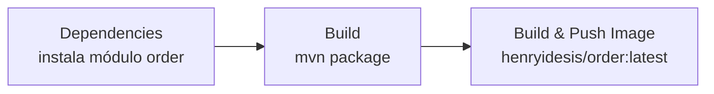

# Como Rodar

## Pré-requisitos

- Docker e Docker Compose instalados
- Arquivo `api/.env` criado (veja abaixo)

## Variáveis de Ambiente

Crie o arquivo `api/.env` — **nunca commite este arquivo** (está no `.gitignore`):

```env
DB_USER=store
DB_NAME=store
DB_PASSWORD=COLOQUE_SUA_SENHA_AQUI
JWT_SECRET_KEY=COLOQUE_SUA_CHAVE_AQUI
VOLUME_DB=./volume
SETUP=./setup
```

!!! danger "Segredos"
    Nunca coloque senhas reais em arquivos que serão commitados. O `.env` está no `.gitignore` justamente para isso.

## Subindo o Stack Completo

```bash
cd api
docker compose up --build
```

| Serviço | Porta |
|---------|-------|
| Gateway | `8080` |
| Order Service | `8085` (direto, sem gateway) |
| PostgreSQL | `5432` |
| Product (WireMock) | interno |
| Exchange (WireMock) | interno |

## Subindo Apenas o Order Service

Para desenvolvimento isolado, as dependências externas são servidas por WireMock:

```bash
cd api
docker compose up --build order product exchange db
```

Os mocks respondem:

| Endpoint mockado | Resposta |
|------------------|----------|
| `GET /products/0195abfb-7074-73a9-9d26-b4b9fbaab0a8` | `{"id": "...", "price": 10.12}` |
| `GET /products/id-inexistente` | `404 Not Found` |
| `GET /exchange?from=USD&to=BRL` | `{"rate": 6.0}` |
| `GET /exchange?from=USD&to=<inválido>` | `404 Not Found` |

## Testes Unitários

```bash
cd api/order-service
mvn test
```

Os 6 testes cobrem os cenários críticos de negócio:

| Teste | Cenário verificado |
|-------|--------------------|
| `shouldReturn400WhenProductDoesNotExist` | Produto não encontrado → 400 |
| `shouldReturn502WhenProductServiceIsUnavailable` | Product Service fora do ar → 502 |
| `shouldFilterOrdersByAuthenticatedAccount` | Isolamento por conta |
| `shouldReturn404WhenOrderDoesNotBelongToAccount` | Pedido de outra conta → 404 |
| `shouldReturn422WhenCurrencyIsInvalid` | Moeda inválida → 422 |
| `shouldKeepUsdValuesWhenExchangeServiceIsUnavailable` | Exchange fora do ar → fallback USD |

## CI/CD

O pipeline Jenkins está em `api/order-service/Jenkinsfile` e executa 3 estágios:



A imagem é publicada no Docker Hub como `henryidesis/order:latest` com suporte multi-arquitetura (`linux/amd64` + `linux/arm64`).
